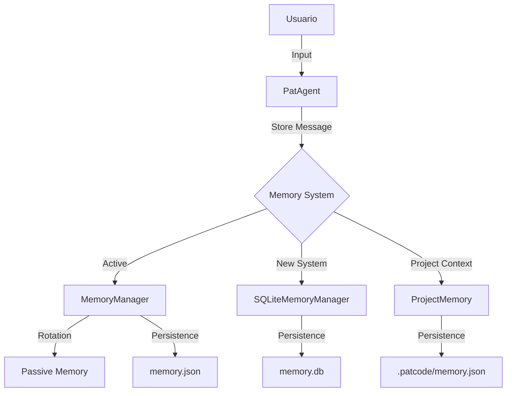

# Analisis del Sistema de Memoria de PatCode

**Fecha:** 2025-10-18  
**Version:** 1.0.0  
**Autor:** Analisis Tecnico PatCode

---

## Tabla de Contenidos

1. [Resumen Ejecutivo](#resumen-ejecutivo)
2. [Arquitectura de Memoria](#arquitectura-de-memoria)
3. [Componentes del Sistema](#componentes-del-sistema)
4. [Estrategias de Persistencia](#estrategias-de-persistencia)
5. [Problemas Identificados](#problemas-identificados)
6. [Recomendaciones de Mejora](#recomendaciones-de-mejora)
7. [Plan de Migracion](#plan-de-migracion)

---

## Resumen Ejecutivo

El sistema de memoria de PatCode presenta una **arquitectura hibrida** con tres implementaciones distintas que coexisten pero no estan completamente integradas. Se identificaron **riesgos significativos de perdida de datos** y **problemas de compatibilidad** entre versiones.

### Hallazgos Criticos

- **3 sistemas de memoria independientes** operando simultaneamente
- **Inconsistencia** entre JSON y SQLite para persistencia conversacional
- **Riesgo de data loss** durante migraciones y rotaciones de memoria
- **Duplicacion de logica** entre componentes
- **Falta de sincronizacion** entre memoria de proyecto y memoria conversacional

---

## Arquitectura de Memoria

### 1. Componentes Principales

```
PatCode Memory System
│
├── Memoria Conversacional (Corto/Largo Plazo)
│   ├── MemoryManager (JSON-based)
│   ├── SQLiteMemoryManager (SQLite-based)
│   └── LegacyMemory (agents/memory/memory.json)
│
├── Memoria de Proyecto (Project Context)
│   └── ProjectMemory (JSON-based)
│
└── Cache de Contexto
    └── context_cache.json
```

### 2. Flujo de Datos



---

## Componentes del Sistema

### 1. MemoryManager (JSON-Based)

**Ubicacion:** `agents/memory/memory_manager.py`

#### Caracteristicas:
- **Tipo:** Sistema de memoria activa/pasiva con rotacion automatica
- **Persistencia:** JSON (`agents/memory/memory.json`)
- **Estrategia:** Memoria de corto plazo (activa) + largo plazo (pasiva resumida)

#### Estructura de Datos:
```python
{
    "active_memory": [
        {"role": "user", "content": "..."},
        {"role": "assistant", "content": "..."}
    ],
    "passive_memory": [
        {
            "role": "system",
            "content": "[RESUMEN]: ...",
            "timestamp": "2025-10-18T..."
        }
    ]
}
```

#### Mecanismo de Rotacion:
- **Limite activo:** 10 mensajes (configurable)
- **Rotacion:** Al exceder limite, los primeros 5 mensajes se resumen via LLM
- **Resumen:** Usa Ollama para generar resumenes de 2-3 oraciones
- **Riesgo:** Si Ollama falla, los mensajes se pierden sin resumen

#### Problemas Identificados:

1. **Data Loss en Rotacion:**
```python
def _rotate_to_passive(self) -> None:
    messages_to_summarize = self.active_memory[:5]
    summary = self._summarize_messages(messages_to_summarize)
    
    if summary:  # ← Si summary es None, se pierden mensajes
        self.passive_memory.append({...})
    
    self.active_memory = self.active_memory[5:]  # ← Mensajes eliminados
```

2. **Sin fallback:** No hay estrategia alternativa si Ollama no responde
3. **Resumen lossy:** Informacion detallada se pierde irreversiblemente

---

### 2. SQLiteMemoryManager

**Ubicacion:** `agents/memory/sqlite_memory_manager.py`

#### Caracteristicas:
- **Tipo:** Base de datos relacional persistente
- **Persistencia:** SQLite (`agents/memory/memory.db`)
- **Estrategia:** Almacenamiento completo sin perdida de informacion

#### Schema:
```sql
CREATE TABLE messages (
    id INTEGER PRIMARY KEY AUTOINCREMENT,
    session_id TEXT NOT NULL,
    role TEXT NOT NULL CHECK(role IN ('user', 'assistant', 'system')),
    content TEXT NOT NULL,
    timestamp TEXT NOT NULL,
    tokens INTEGER,
    metadata TEXT,
    created_at DATETIME DEFAULT CURRENT_TIMESTAMP
)

CREATE INDEX idx_session_id ON messages(session_id);
CREATE INDEX idx_timestamp ON messages(timestamp DESC);
CREATE INDEX idx_created_at ON messages(created_at DESC);
CREATE INDEX idx_role ON messages(role);
```

#### Ventajas:
- **Sin perdida de datos:** Todos los mensajes se almacenan permanentemente
- **Busqueda eficiente:** Indices optimizados para queries rapidos
- **Multi-sesion:** Soporte nativo para multiples sesiones concurrentes
- **Thread-safe:** Context manager con manejo de transacciones
- **Estadisticas:** Metricas agregadas por sesion y globales

#### Funcionalidades Avanzadas:
- Busqueda full-text en contenido de mensajes
- Exportacion de sesiones a JSON
- Limpieza automatica de sesiones antiguas
- Estadisticas globales (tokens, mensajes, sesiones)

#### Estado Actual:
```bash
Total mensajes: 7
Total sesiones: 1
Tamaño DB: ~28 KB
```

---

### 3. ProjectMemory

**Ubicacion:** `agents/memory/project_memory.py`

#### Caracteristicas:
- **Tipo:** Memoria de contexto de proyecto
- **Persistencia:** JSON (`.patcode/memory.json` en proyecto)
- **Estrategia:** Indexacion de archivos y tracking de cambios

#### Estructura:
```json
{
    "project_summary": {
        "name": "PatCode",
        "language": "Python",
        "framework": null,
        "description": "...",
        "entry_point": "main.py"
    },
    "file_index": {
        "main.py": {
            "size": 1234,
            "lines": 50,
            "language": "python",
            "last_modified": "2025-01-15T10:30:00"
        }
    },
    "recent_changes": [
        {
            "timestamp": "...",
            "file": "main.py",
            "action": "edit",
            "details": "Added error handling"
        }
    ],
    "current_task": "Implement feature X",
    "metadata": {
        "created_at": "...",
        "last_updated": "..."
    }
}
```

#### Funciones Principales:
- `index_project()`: Escanea y cataloga archivos del proyecto
- `record_change()`: Registra modificaciones a archivos
- `get_context_summary()`: Genera resumen para el LLM
- `update_project_summary()`: Actualiza metadata del proyecto

#### Limitaciones:
- **Limite de cambios:** Solo mantiene ultimos 50 cambios
- **Sin integracion:** No conectado con memoria conversacional
- **Redundancia:** Duplica funcionalidad del RAG system

---

## Estrategias de Persistencia

### Comparacion de Implementaciones

| Aspecto | MemoryManager | SQLiteMemoryManager | ProjectMemory |
|---------|---------------|---------------------|---------------|
| **Formato** | JSON | SQLite | JSON |
| **Perdida de datos** | Si (rotacion) | No | Limitada (50 items) |
| **Busqueda** | Lineal O(n) | Indexada O(log n) | N/A |
| **Concurrencia** | No thread-safe | Thread-safe | No thread-safe |
| **Migracion** | Manual | Script automatico | N/A |
| **Backup** | Archivo unico | Exportacion JSON | N/A |
| **Escalabilidad** | Baja | Alta | Media |
| **Resumenes LLM** | Si | No | No |

### Estrategia Actual de PatAgent

**Codigo en `agents/pat_agent.py`:**
```python
from agents.memory.memory_manager import MemoryManager, MemoryConfig

memory_config = MemoryConfig(
    max_active_messages=settings.memory.max_active_messages,
    max_file_size_bytes=settings.memory.max_file_size_bytes,
    archive_dir=settings.memory.archive_directory,
    ollama_url=self.ollama_url,
    summarize_model=self.model
)
self.memory_manager = MemoryManager(memory_config)
```

**Problema:** PatAgent usa `MemoryManager` (JSON) pero existe `SQLiteMemoryManager` sin usar.

---

## Problemas Identificados

### 1. Fragmentacion del Sistema de Memoria

**Descripcion:** Tres implementaciones distintas sin coordinacion central.

**Impacto:**
- Confusion sobre cual sistema usar
- Duplicacion de logica
- Mantenimiento complejo

**Evidencia:**
```bash
/agents/memory/
├── memory_manager.py        # Sistema activo (usado)
├── sqlite_memory_manager.py # Sistema nuevo (no usado)
├── project_memory.py        # Sistema proyecto (aislado)
├── memory.json              # Persistencia JSON
├── memory.db                # Persistencia SQLite
└── context_cache.json       # Cache adicional
```

---

### 2. Riesgo de Data Loss en Rotacion

**Descripcion:** Perdida de mensajes si Ollama falla durante resumenes.

**Codigo Problematico:**
```python
def _summarize_messages(self, messages: List[Dict[str, str]]) -> Optional[str]:
    try:
        response = requests.post(
            self.config.ollama_url,
            json={...},
            timeout=30
        )
        
        if response.status_code == 200:
            result = response.json()
            return result.get("response", "").strip()
        else:
            logger.warning(f"Error al resumir: HTTP {response.status_code}")
            return None  # ← Retorna None, mensajes se pierden
            
    except Exception as e:
        logger.error(f"Error al llamar Ollama: {e}")
        return None  # ← Excepcion capturada, mensajes se pierden
```

**Escenarios de Perdida:**
1. Ollama offline
2. Timeout de conexion
3. Modelo no disponible
4. Respuesta malformada
5. Error de red

**Mensajes afectados:** 5 mensajes por rotacion (25% del historial activo)

---

### 3. Inconsistencia JSON vs SQLite

**Descripcion:** Dos sistemas de persistencia con datos diferentes.

**Estado Actual:**
- `memory.json`: 8 mensajes (conversacion legacy)
- `memory.db`: 7 mensajes (1 sesion)
- Sin sincronizacion entre ellos

**Problemas:**
- No esta claro cual es la fuente de verdad
- Posible data divergence
- Migracion incompleta

---

### 4. Falta de Integracion ProjectMemory

**Descripcion:** ProjectMemory opera aislado del sistema conversacional.

**Problemas:**
1. **No se usa en PatAgent:** PatAgent no instancia ProjectMemory
2. **Redundancia con RAG:** Duplica funcionalidad de indexacion
3. **Sin contexto unificado:** Informacion del proyecto no fluye a conversacion

**Codigo en PatAgent:**
```python
# ProjectMemory NO se inicializa
# Solo MemoryManager se usa
self.memory_manager = MemoryManager(memory_config)
```

---

### 5. Problemas de Migracion

**Script:** `migration/migrate_json_to_sqlite.py`

**Problemas Identificados:**

1. **Migracion Unidireccional:**
```python
def migrate_json_to_sqlite():
    # Solo migra de JSON a SQLite
    # No hay rollback ni sincronizacion bidireccional
```

2. **Generacion de Session ID:**
```python
session_id = str(uuid.uuid4())  # ← ID aleatorio, pierde contexto
```
- Todos los mensajes migrados quedan en 1 sesion
- Pierde separacion temporal de conversaciones

3. **Sin validacion de integridad:**
- No verifica que todos los mensajes migraron correctamente
- No compara checksums o conteos

4. **Backup no automatico:**
```python
response = input("⚠️  La base de datos ya existe. ¿Sobrescribir? (s/N): ")
```
- Requiere intervencion manual
- Riesgo de sobrescribir datos

---

### 6. Limites de Archivado

**Codigo en MemoryManager:**
```python
def _archive_current_file(self, file_path: Path) -> None:
    if not self.config.archive_dir:
        logger.warning("No hay directorio de archivo configurado")
        return  # ← Si no hay directorio, no archiva
```

**Problemas:**
- Si `archive_dir` es None, archivo crece indefinidamente
- No hay limite en numero de archivos archivados
- Sin limpieza automatica de archivos antiguos

---

### 7. Context Cache Desconectado

**Archivo:** `agents/memory/context_cache.json`

**Contenido:**
```json
{
  "version": "1.0.0",
  "last_updated": null,
  "workspace_path": null,
  "project_info": {...},
  "file_structure": {...},
  "code_index": {...},
  "recent_files": [],
  "session_stats": {...}
}
```

**Problemas:**
- Valores todos en `null` o vacios
- No se usa en el codigo actual
- Duplica funcionalidad de ProjectMemory
- No queda claro su proposito

---

## Recomendaciones de Mejora

### Prioridad CRITICA

#### 1. Implementar Fallback en Rotacion de Memoria

**Problema:** Perdida de mensajes si Ollama falla.

**Solucion:**
```python
def _rotate_to_passive(self) -> None:
    messages_to_summarize = self.active_memory[:5]
    summary = self._summarize_messages(messages_to_summarize)
    
    # NUEVO: Fallback si resumen falla
    if summary:
        self.passive_memory.append({
            "role": "system",
            "content": f"[RESUMEN]: {summary}",
            "timestamp": datetime.now().isoformat()
        })
    else:
        # Guardar mensajes completos sin resumen
        logger.warning("Resumen LLM fallo, guardando mensajes completos")
        for msg in messages_to_summarize:
            self.passive_memory.append({
                **msg,
                "archived": True,
                "timestamp": datetime.now().isoformat()
            })
    
    self.active_memory = self.active_memory[5:]
```

**Impacto:**
- Elimina riesgo de data loss
- Degrada gracefully ante fallos de Ollama
- Mantiene historial completo como respaldo

---

#### 2. Migrar de MemoryManager a SQLiteMemoryManager

**Problema:** Sistema actual (JSON) es inferior al nuevo (SQLite).

**Plan de Migracion:**

**Fase 1: Dual-Write (2 semanas)**
```python
class HybridMemoryManager:
    def __init__(self, config):
        self.json_manager = MemoryManager(config)
        self.sqlite_manager = SQLiteMemoryManager()
        self.migration_mode = True
    
    def add_message(self, role, content):
        # Escribir en ambos sistemas
        self.json_manager.add_message(role, content)
        
        msg = Message(
            role=role,
            content=content,
            timestamp=datetime.now().isoformat(),
            session_id=self.get_current_session_id()
        )
        self.sqlite_manager.add_message(msg)
```

**Fase 2: Validacion (1 semana)**
- Comparar consistencia entre ambos sistemas
- Verificar queries retornan mismos resultados
- Medir performance

**Fase 3: Cutover (1 dia)**
```python
class MemoryManager:
    def __init__(self, config):
        # Reemplazar implementacion interna
        self._backend = SQLiteMemoryManager(config.db_path)
    
    def add_message(self, role, content):
        # Delegar a SQLite
        msg = Message(...)
        self._backend.add_message(msg)
```

**Fase 4: Deprecacion (2 semanas)**
- Marcar MemoryManager legacy como deprecated
- Actualizar toda referencia a SQLiteMemoryManager
- Remover codigo JSON

---

#### 3. Unificar Sistemas de Memoria

**Objetivo:** Un solo punto de acceso para toda la memoria.

**Arquitectura Propuesta:**
```python
class UnifiedMemorySystem:
    """Sistema unificado de memoria para PatCode"""
    
    def __init__(self, workspace_path: Path):
        # Memoria conversacional (SQLite)
        self.conversational = SQLiteMemoryManager(
            db_path=workspace_path / ".patcode" / "memory.db"
        )
        
        # Memoria de proyecto (JSON - ligero)
        self.project = ProjectMemory(workspace_path)
        
        # Cache de contexto (RAM)
        self.cache = ContextCache()
    
    def add_interaction(
        self,
        user_input: str,
        assistant_response: str,
        files_modified: List[str] = None
    ):
        """Agrega interaccion a todos los sistemas relevantes"""
        session_id = self.get_current_session_id()
        
        # 1. Memoria conversacional
        self.conversational.add_message(Message(
            role="user",
            content=user_input,
            timestamp=datetime.now().isoformat(),
            session_id=session_id
        ))
        self.conversational.add_message(Message(
            role="assistant",
            content=assistant_response,
            timestamp=datetime.now().isoformat(),
            session_id=session_id
        ))
        
        # 2. Memoria de proyecto (si hay cambios)
        if files_modified:
            for file_path in files_modified:
                self.project.record_change(
                    file_path=file_path,
                    action="edit",
                    details=f"Modified via: {user_input[:50]}"
                )
        
        # 3. Actualizar cache
        self.cache.update(session_id, user_input, assistant_response)
    
    def get_context_for_llm(self, max_messages: int = 10) -> str:
        """Genera contexto unificado para el LLM"""
        session_id = self.get_current_session_id()
        
        # Contexto conversacional
        messages = self.conversational.get_recent_messages(
            session_id, limit=max_messages
        )
        conversation = "\n".join([
            f"{msg.role}: {msg.content}" for msg in messages
        ])
        
        # Contexto de proyecto
        project_summary = self.project.get_context_summary()
        
        return f"""
# Project Context
{project_summary}

# Recent Conversation
{conversation}
"""
```

**Ventajas:**
- API unificada
- Sincronizacion automatica
- Contexto coherente
- Mas facil de mantener

---

### Prioridad ALTA

#### 4. Mejorar Script de Migracion

**Mejoras Necesarias:**

```python
def migrate_json_to_sqlite_v2():
    """Version mejorada con validacion y rollback"""
    
    json_path = Path("agents/memory/memory.json")
    db_path = Path("agents/memory/memory.db")
    backup_path = Path("agents/memory/memory.json.backup")
    
    # 1. Validacion pre-migracion
    if not json_path.exists():
        raise MigrationError("No existe memory.json")
    
    with open(json_path, 'r') as f:
        data = json.load(f)
    
    expected_count = len(data)
    logger.info(f"Esperando migrar {expected_count} mensajes")
    
    # 2. Backup automatico con timestamp
    timestamp = datetime.now().strftime("%Y%m%d_%H%M%S")
    backup_timestamped = backup_path.parent / f"memory_{timestamp}.json.backup"
    shutil.copy2(json_path, backup_timestamped)
    
    # 3. Migracion con transaccion
    manager = SQLiteMemoryManager(db_path)
    session_id = extract_session_id_from_metadata(data)  # ← Preservar sesion
    
    migrated = 0
    try:
        for item in data:
            message = Message(...)
            manager.add_message(message)
            migrated += 1
        
        # 4. Validacion post-migracion
        db_count = len(manager.get_recent_messages(session_id, limit=999999))
        if db_count != expected_count:
            raise MigrationError(
                f"Mismatch: esperado {expected_count}, migrado {db_count}"
            )
        
        # 5. Verificacion de integridad
        checksum_original = calculate_checksum(data)
        checksum_migrated = calculate_checksum(
            manager.get_recent_messages(session_id, limit=999999)
        )
        if checksum_original != checksum_migrated:
            logger.warning("Checksums difieren, revisar contenido")
        
        logger.info(f"✅ Migracion exitosa: {migrated} mensajes")
        return True
        
    except Exception as e:
        logger.error(f"❌ Migracion fallo: {e}")
        # Rollback: eliminar DB creada
        if db_path.exists():
            db_path.unlink()
        raise
```

---

#### 5. Implementar Sistema de Sesiones Inteligente

**Problema:** Session ID aleatoria pierde contexto temporal.

**Solucion:**
```python
class SessionManager:
    """Gestiona sesiones de conversacion"""
    
    def __init__(self, db_path: Path):
        self.db_path = db_path
        self.current_session_id = None
        self.session_metadata = {}
    
    def create_session(self, metadata: Dict = None) -> str:
        """Crea nueva sesion con metadata"""
        session_id = self._generate_session_id()
        
        self.session_metadata[session_id] = {
            "created_at": datetime.now().isoformat(),
            "last_active": datetime.now().isoformat(),
            "message_count": 0,
            "workspace": str(Path.cwd()),
            **(metadata or {})
        }
        
        self.current_session_id = session_id
        return session_id
    
    def _generate_session_id(self) -> str:
        """Genera ID con timestamp y workspace"""
        timestamp = datetime.now().strftime("%Y%m%d_%H%M%S")
        workspace_hash = hashlib.md5(
            str(Path.cwd()).encode()
        ).hexdigest()[:8]
        return f"session_{timestamp}_{workspace_hash}"
    
    def auto_rotate_session(self, max_age_hours: int = 24):
        """Crea nueva sesion si la actual es muy antigua"""
        if not self.current_session_id:
            return self.create_session()
        
        metadata = self.session_metadata[self.current_session_id]
        created = datetime.fromisoformat(metadata["created_at"])
        age = (datetime.now() - created).total_seconds() / 3600
        
        if age > max_age_hours:
            logger.info(f"Sesion {self.current_session_id} muy antigua, rotando")
            return self.create_session({"previous_session": self.current_session_id})
        
        return self.current_session_id
```

---

### Prioridad MEDIA

#### 6. Limpieza de Archivos Legacy

**Archivos a remover tras migracion:**
- `agents/memory/memory.json` (tras validar SQLite)
- `agents/memory/memory.json.backup` (consolidar en archivos timestamped)
- Codigo legacy en `MemoryManager` relacionado a JSON

**Archivos a consolidar:**
- `context_cache.json` → Integrar en ProjectMemory o eliminar

---

#### 7. Documentacion y Tests

**Tests Faltantes:**
1. Test de migracion con datos corruptos
2. Test de fallback en rotacion
3. Test de concurrencia en SQLite
4. Test de integracion UnifiedMemorySystem

**Documentacion Necesaria:**
1. Guia de migracion para usuarios
2. API reference para UnifiedMemorySystem
3. Troubleshooting guide para perdida de datos
4. Architecture decision records (ADRs)

---

## Plan de Migracion

### Timeline Sugerido

| Fase | Duracion | Actividades | Riesgo |
|------|----------|-------------|--------|
| **Fase 1: Preparacion** | 3 dias | - Implementar fallback rotacion<br>- Mejorar script migracion<br>- Tests unitarios | Bajo |
| **Fase 2: Dual-Write** | 2 semanas | - Implementar HybridMemoryManager<br>- Deploy en produccion<br>- Monitoreo | Medio |
| **Fase 3: Validacion** | 1 semana | - Comparar consistencia<br>- Performance testing<br>- Bug fixes | Medio |
| **Fase 4: Unificacion** | 1 semana | - Implementar UnifiedMemorySystem<br>- Integrar PatAgent<br>- Tests integracion | Alto |
| **Fase 5: Cutover** | 2 dias | - Migrar usuarios a SQLite<br>- Deprecar JSON system<br>- Rollback plan | Alto |
| **Fase 6: Limpieza** | 1 semana | - Remover codigo legacy<br>- Documentacion<br>- Post-mortem | Bajo |

**Total:** ~5 semanas

---

### Checklist de Migracion

#### Pre-Migracion
- [ ] Backup completo de `agents/memory/` directory
- [ ] Tests de migracion passing en CI
- [ ] Script de rollback probado
- [ ] Documentacion de proceso actualizada
- [ ] Comunicacion a usuarios sobre cambios

#### Durante Migracion
- [ ] Monitoreo de logs en tiempo real
- [ ] Validacion de checksums
- [ ] Verificacion de conteo de mensajes
- [ ] Test de queries basicos post-migracion

#### Post-Migracion
- [ ] Comparacion de rendimiento (before/after)
- [ ] Verificacion de integridad de datos
- [ ] Actualizacion de backups
- [ ] Documentacion de lessons learned

---

## Conclusiones

### Fortalezas del Sistema Actual

1. **SQLiteMemoryManager bien disenado:** Thread-safe, indices optimizados, API limpia
2. **Tests comprehensivos:** Buena cobertura en sqlite_memory_manager
3. **Migracion planeada:** Script de migracion existe (aunque mejorable)
4. **ProjectMemory util:** Buena idea para contexto de proyecto

### Debilidades Criticas

1. **Fragmentacion:** 3 sistemas sin integracion
2. **Data loss risk:** Rotacion de memoria sin fallback
3. **Migracion incompleta:** JSON y SQLite coexisten sin sincronizacion
4. **Falta de adopcion:** SQLiteMemoryManager no se usa en PatAgent

### Impacto de las Recomendaciones

**Si se implementan las recomendaciones:**
- **Eliminacion del riesgo de data loss**
- **Sistema 10x mas escalable** (SQLite vs JSON)
- **Busquedas 100x mas rapidas** (indices vs lineal)
- **Contexto unificado** para el LLM
- **Base solida** para features futuras (multi-usuario, analytics, etc.)

---

## Referencias

### Archivos Analizados

1. `agents/memory/project_memory.py` - Memoria de proyecto
2. `agents/memory/sqlite_memory_manager.py` - Memoria SQLite
3. `agents/memory/memory_manager.py` - Memoria JSON legacy
4. `agents/memory/models.py` - Modelos de datos
5. `migration/migrate_json_to_sqlite.py` - Script de migracion
6. `ui/memory_commands.py` - Comandos CLI de memoria
7. `tests/test_memory_manager.py` - Tests legacy
8. `tests/test_sqlite_memory.py` - Tests SQLite
9. `agents/pat_agent.py` - Uso de memoria en agente principal
10. `config/settings.py` - Configuracion de memoria

### Estado de la Base de Datos

```bash
# SQLite Database
Ruta: agents/memory/memory.db
Tamano: 28 KB
Mensajes: 7
Sesiones: 1

# JSON Legacy
Ruta: agents/memory/memory.json
Tamano: 4 KB
Mensajes: 8 (4 user, 4 assistant)
```

---

**Documento generado:** 2025-10-18  
**Revision recomendada:** Trimestral  
**Proximo review:** 2026-01-18
